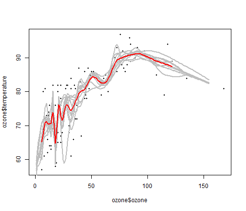

  

## Bootstrap Aggregating (bagging)
### What is Bagging
1. Bagging resamples a set of training data multiple time.
2. A prediction algorithm is then applied to each of the training set permutations.
3. The predictions are then combined together (averaged or majority vote)

### Benefits of Bagging
1. Bagging reduced the variablity of the prediction.
2. Works best with non linear functions

---

## Resampling Simulation
- This application will simulate resampling of data
- The application allows the user to resample the data using a variable number of times.
- The purpose of the application is to show how changing the number of times we resample the data changes the prediction curve.
- The application uses Shiny and uses the slider interactive element to gather user input.

---

## Demo Chart
This is the chart used in the application, here it is demonstrated with resampling 10 times.


```r
plot(ozone$ozone,ozone$temperature,pch=19,cex=0.5)
for(i in 1:samp){lines(1:155,ll[i,],col="grey",lwd=2)}
lines(1:155,apply(ll,2,mean),col="red",lwd=2)
```



---

## Conclusion
- This application is highly interactive
- It demonstrate the concept of Bagging
- It demonstrate the capabilities of a shiny application
- It is fun to play with entertaining and educating

